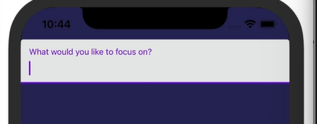

//adding text input
//now text visibility coming from Focus.js file
//react-native-paper docs explore
//~npm install react-native-paper
//~npm install react-native-safe-area-context
//
//creating input text from box
//set up react-native-paper
//Focus.js.......................................
import React from 'react';
import { View, Text, StyleSheet } from 'react-native';

import { TextInput } from 'react-native-paper';

import { colors } from '../utils/colors';

export const Focus = () => (
    <View style = {styles.container}>
        <TextInput label="What would you like to focus on?" />
    </View>
)

const styles = StyleSheet.create({
    container: {
        flex:1,
    

    },

    text: {
        color: colors.white,
    }
});

//Focus.js...............................................
import React from 'react';
import { View, Text, StyleSheet } from 'react-native';

import { TextInput } from 'react-native-paper';

import { colors } from '../utils/colors';

export const Focus = () => (
    <View style = {styles.container}>
        <View style = {styles.inputContainer}>
        <TextInput label="What would you like to focus on?" />
        </View>
    </View>
)

const styles = StyleSheet.create({
    container: {
        flex:1,
    },

    inputContainer: {
        flex:0.5,
        padding: 25,
        justifyContent: 'top',
        // it define the input box position
    },

    text: {
        color: colors.white,
    }
});

//now we need to store that input data